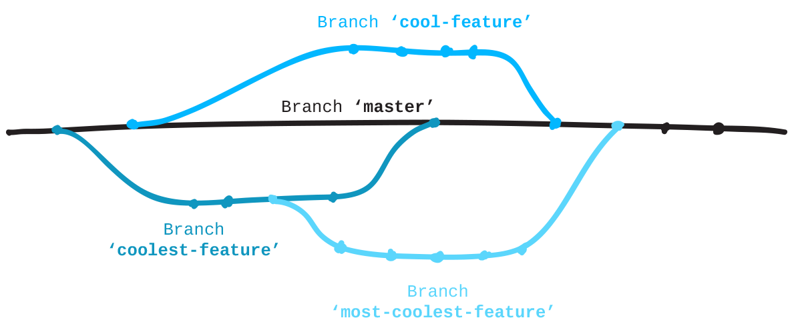

# git-it

## Very Basic
. mkdir
. git init
. git status
. git add <filename>... //add files listed by names divided by spaces
. git add . // add all
. git commit -m "your commit message"
. git config --global user.username //show
. git config --global user.email //show
. git config --global user.username <username> //set
. git config --global user.email <email> //set
. git remote add origin <remoteUrl>
+
 The primary remote is typically named origin.
. git remote set-url origin <remoteUrl>
. git remote -v //View remote addresses
. git push <REMOTENAME> <BRANCH>
. git pull <REMOTENAME> <BRANCHNAME>

## fork

* When you *fork a repository*, you're creating a copy of it *on your GitHub account*. 
* Forks are used for creating your own version of a project (this diversion from the original is like taking a fork in the road) or contributing back your changes (such as bug fixes or new features) to the original project.
* To get a forked repository from your GitHub account onto your computer you *clone* it.

.pull vs fork-clone
image::clone.png[alt]

.fork and clone
[plantuml]
----
@startuml
digraph G {
    rankdir="LR"
    ru[label="remote\nupstream"]
    rd[label="remote\ndownstream"]
    ru -> rd[label="fork"]
    rd->local[label = "clone"]
}
@enduml
----

. fork a copy upstream on github
. git clone <URL of fork copy FROM GITHUB>
+
automatically connected to the remote as *origin*
. git remote add upstream <URL of upstream copy FROM GITHUB>
+
You can name this remote connection anything you want, but typically people use the name `*upstream*`

## branch

* Git repositories use branches to *isolate work* when needed
* This way you can do your work while the main, commonly named 'master', branch stays stable
* When the work on your branch is finished you *merge* it back into the 'master' master branch

.branches

* You can even branch off of a branch if you need to
* the 'master' branch doesn't have to be the base

### GitHub Pages

* GitHub will automatically serve and host static website files in branches named 'gh-pages'.
* All repositories that have a 'gh-pages' branch with website files can be found, live online, using this pattern for the URL:
+
http://githubusername.github.io/repositoryname
* When you create a branch, Git copies everything from the current branch you're on and places it in the branch you've requested be made

. git branch <branchname> //create branch
. git checkout <branchname> //checkout a branch
+
[TIP]
====
git checkout -b <BRANCHNAME> //create and switch to a branch in one line
====
. git branch //list branchs
. git branch -m <newname> //rename current branch
. bit status //verify branch you are working on

## Add a collaborator

Collaborators:: are other GitHub users who are given permission to make edits to a repository owned by someone else.

Contributor:: this describes another GitHub user who has made contributions, through a Fork and Pull Request, to a project.

### add collaborators
.  repository's page on your GitHub account\setting\manage access
. git pull <REMOTENAME> <REMOTEBRANCH> //Pull in changes from a remote branch
. git fetch --dry-run //See changes to the remote before you pull in

## Repuesting Pull

## Merge

Once you don't need branches anymore you can delete them locally and remotely. This is helpful so that you don't end up with a pile of old branches.

. First, *move into the branch you want to merge into* —in this case, the branch 'gh-pages'.
+
git checkout gh-pages
. Now tell Git what branch you want to merge in—in this case, your feature branch that begins with "add-".
+
git merge <BRANCHNAME>
. Tidy up by deleting your feature branch. Now that it has been merged you don't really need it around.
+
git branch -d <BRANCHNAME>

. You can also delete the branch from your remote on GitHub:
+
git push <REMOTENAME> --delete <BRANCHNAME>